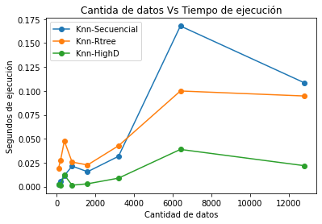

# BD2-P003 Facial Recognition 😎

## Integrantes 🙋‍♂️
- Matias Avendaño Vargas  [Matias222]
- Paolo Armas Vega [Paoloav26]

## Profesor 🦾
- Heider Sanchez Enriquez

## Objetivos Principales 🎯
- Este proyecto está enfocado al uso una estructura multidimensional para dar soporte a las búsqueda y 
recuperación eficiente de imágenes en un servicio web de reconocimiento facial.

## Comenzando 🚀
### Pre-requisitos 📋
- Python >= 3.8
### Despliegue 📦
 Crear en server, una carpeta de nombre "static" en ella agregar la dataset (http://vis-www.cs.umass.edu/lfw/), no la podimos subir al presente git por el peso del archivo.  
- Ejecutar archivo __init__.py de la carpeta server
### Dataset
- El conjunto de fotografías del laboratorio 11 que consta de 13233 imágenes de 5749 personas distintas.
### Librerías empleadas
- Pickle: Facilita el guardado de diccionarios en memoria secundaria, esto lo empleamos para extraer los vectores característicos del dataset sólo una vez.  

- Face Recognition: Permite la extracción de los vectores característicos de cada fotografía, estos son 128 dimensional.  

- Rtree: Genera el índice Rtree en memoria secundaria, contiene una función que devuelve los K elementos más cercanos a una query.   

- Faiss: Índice multidimensional eficiente, entre sus distinciones con otros algoritmos el uso de multithreading a nivel de GPU, el uso de BLAS (Basic Linear Algebra Subprogram) para el cómputo de las distancias y vectorización SIMD 

### Métodos
- Computamos para toda la dataset los vectores característicos y los guardamos en memoria secundaria a través de Pickle, esto con el objetivo de no voler a realizar ese cálculo tan costoso, posteriormente realizamos las consultas a KNNheap, KNNRtree y KNNHigh, a excepción de la primera función (que consta de calcular las distancias euclidianas entre la consulta y toda la dataset) los demás métodos en sus librerías respectivas ya facilitan los K vecinos más cercanos.

### Maldición de la dimensionalidad
- Trabajamos con 128 dimensiones, para lo cual no hemos encontrado esparcidad en nuestras respuestas, sin embargo, hemos notado como observaremos en experimentación que probablemente se pueda aumentar aun más el tamaño del vector latente, no obstante, si hallamos un gran incoveniente en los tiempos de cómputo, esto se puede reducir mediante una técnica de reducción de la dimensionalidad como PCA pero el problema de aplicar eso es que perderiamos cálidad en las respuestas.

### Experimentación

 
| First Header  | KNN-Secuencial | KNN-RTree | KNN- HighD |
| ------------- | ------------- | ------------- | ------------- |
| N = 100       |      0.00185037s         |      0.01941872s         |     0.00194693s          |
| N = 200       |       0.00560069s        |         0.02719474s      |       0.00145698s        |
| N = 400       |        0.01148677s       |         0.04768586s      |       0.01214409s        |
| N = 800       |       0.02149701s        |        0.02569628s       |         0.00153877s      |
| N = 1600      |      0.01558828s         |         0.02265048s      |         0.00298381s      |
| N = 3200      |        0.03169847s       |      0.04271317s         |        0.00888276s       |
| N = 6400      |      0.16779065s         |         0.09990478s      |        0.03889823s       |
| N = 12800     |       0.10855675s        |         0.09469271s      |        0.02192521s       |

 
 

 
 ### Análisis y conclusiones
 - Es interesante notar que cuándo la cantidad de elementos es baja, faiss y sequential se comportan casi igual, esto suponemos que es debido a la complejidad estructural del segundo, además tambien notamos que cuando se ejecutaba la misma query dos veces seguidas, al segundo intento el tiempo disminuia dramaticamente, esto inferimos que es por el principio de localidad de memoria y su optimizacion respectiva en faiss, ya para n>=1600 es palmaria la superioridad de HighD.

### Link del video
- https://drive.google.com/drive/folders/117f0w7vvIdVeeqkj7HxRO33GJpth0OWE?usp=sharing
